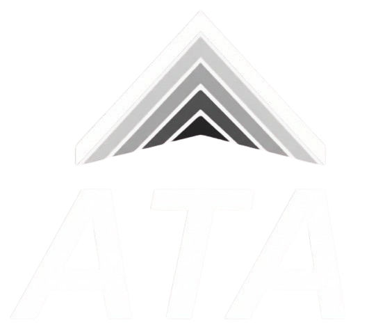
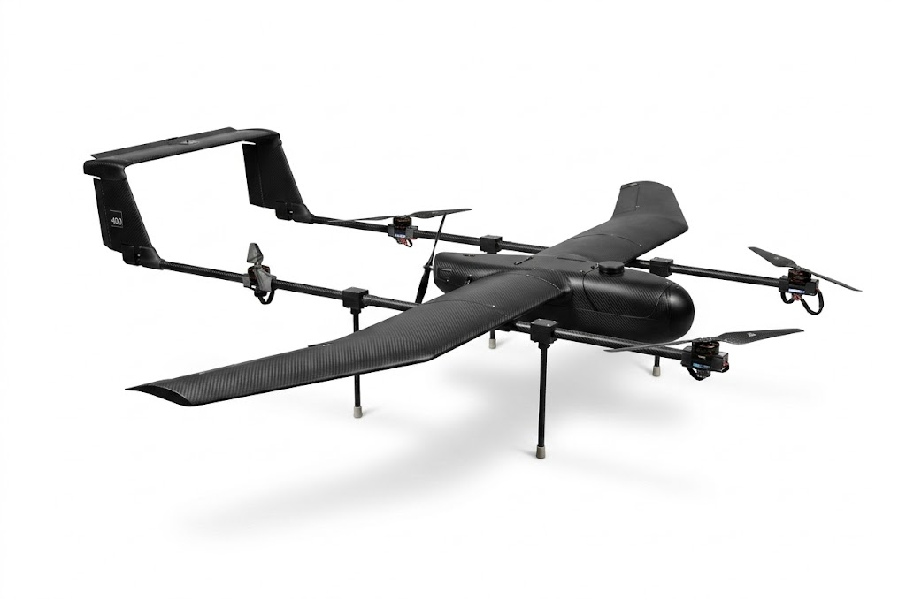
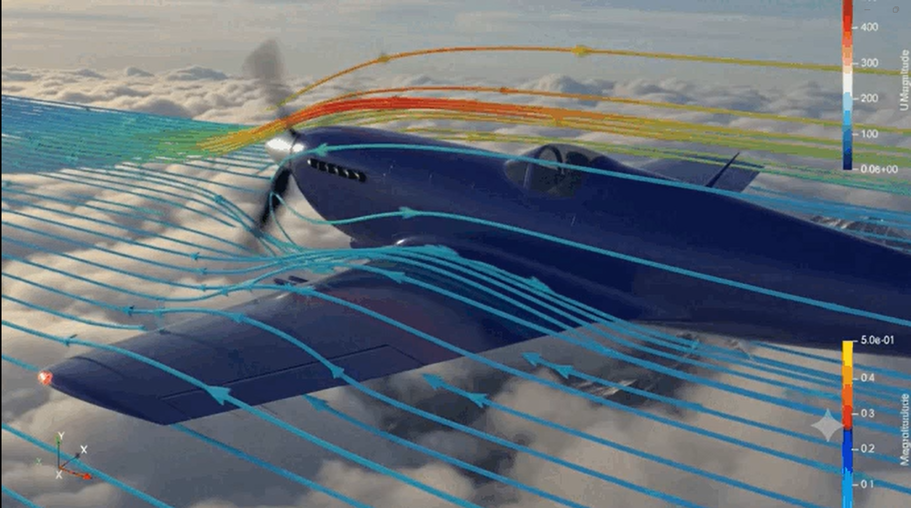
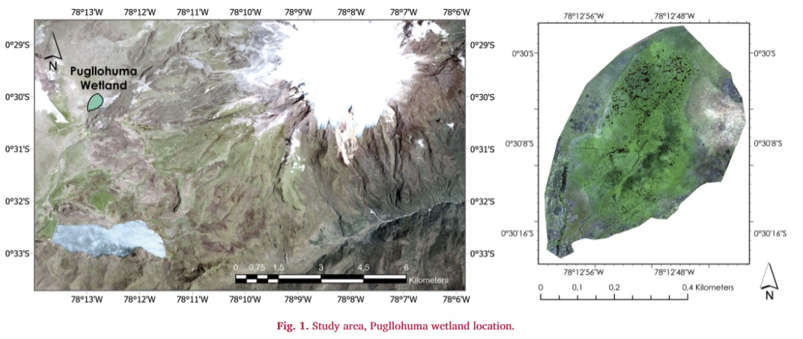
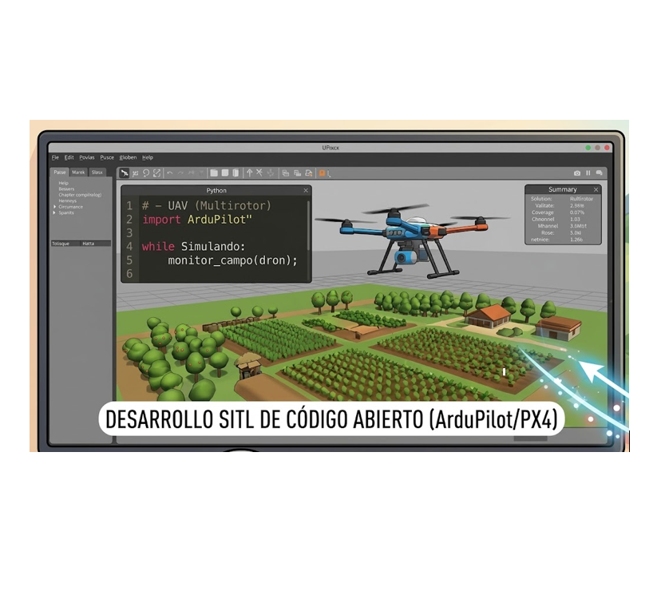

<div align="center">
  <a href="https://www.epn.edu.ec/" target="_blank">
    
  </a>
  &nbsp;&nbsp;&nbsp;&nbsp;&nbsp;&nbsp;
  <a href="https://ata-research-group.github.io/Web/" target="_blank">
    
  </a>

  # ✈️ ATA Research Group | Repositorio Oficial del Sitio Web

  [](https://ata-research-group.github.io/Web/)
  [](https://www.epn.edu.ec/)
  <br>
  [](https://github.com/ata-research-group/Web)
  
  <br>
  
  🌐 <strong>Leer en otros idiomas / Read this in other languages:</strong>
  <br>
  <a href="README.md">🇪🇸 Español</a> | <a href="README.en.md">🇬🇧 English</a>
</div>

<br>

<div align="center">
  <h2>📖 Descripción General</h2>
</div>

**ATA Research Group** es un equipo de investigación e ingeniería de la **Escuela Politécnica Nacional (EPN)**, especializado en Aeronáutica y Termofluidos. 

Este repositorio contiene el código fuente y el diseño de nuestro sitio web oficial. Esta plataforma se crea con el objetivo de difundir el trabajo académico y dar a conocer los avances de todos los que forman parte del laboratorio: investigadores, pasantes y tesistas.

<div align="center">
  <h2>🎯 Núcleo de Investigación</h2>
  <p><i>Nuestro trabajo se enfoca en resolver desafíos de ingeniería aplicada a través de cinco pilares fundamentales:</i></p>
</div>

<br>

#### ✈️ Sistemas Aeroespaciales (UAVs)
> Diseño aerodinámico, cálculo estructural y ensamblaje de hardware para diversas arquitecturas de vehículos aéreos no tripulados. Nuestra investigación abarca el desarrollo y optimización de plataformas de ala fija, configuraciones multirrotor y sistemas híbridos, adaptando la propulsión y dinámica de vuelo a las exigencias operativas de cada misión.

<div align="center">
  
</div>


---

#### 📡 Telecomunicaciones de Vuelo
> Desarrollo de sistemas de telemetría ininterrumpida y redes de comunicación de alcance extendido, incluyendo integración con enlaces satelitales.


<div align="center">
  
</div>

---

---

#### ⚙️ Sistemas Embebidos e Instrumentación
> Diseño de arquitecturas de monitoreo IoT (mediante microcontroladores) para la adquisición precisa de datos en laboratorio y en campo.

<div align="center">
  
</div>

---

#### 🌍 Procesamiento de Datos Geoespaciales
> Análisis computacional y modelado avanzado de topografías. Gestionamos la data recopilada por UAVs en misiones de monitoreo ambiental (como levantamientos en entornos volcánicos y perfiles de ecosistemas complejos), generando ortomosaicos y simulaciones precisas de entornos físicos.

<div align="center">
  
</div>

---

#### 🧠 Procesamiento de Señales y Visión Artificial
> Implementación de arquitecturas de redes neuronales y algoritmos de clasificación para el procesamiento avanzado de imágenes y señales. Aplicamos análisis matemático y segmentación visual computacional en entornos de desarrollo para automatizar la interpretación de la data capturada.

<div align="center">
  
</div>

<br>

<div align="center">
  
</div>

<br>

---

<div align="center">
  <h2>🚁 Plataformas de Investigación UAV</h2>
</div>

<div align="center">
  
</div>
<br>

---

<div align="center">
  <h2>🗂️ Arquitectura del Sitio y Navegación</h2>
</div>

El sitio web tiene una estructura estática y sencilla. Cuenta con una barra de navegación para las secciones generales, en las que se tiene: equipo, galería, contacto y enlaces directos a páginas específicas para documentar cada línea de investigación.

<div align="center">
  <h2>📍 Navegación Principal</h2>
</div>

| Ruta | Sección | Propósito |
| :--- | :--- | :--- |
| `/index` | **Inicio** | *Landing page* principal, resumen de impacto y métricas. |
| `/nosotros` | **Nuestro Equipo** | Perfiles del equipo multidisciplinario. |
| `/proyectos` | **Hub de Proyectos** | Directorio central de líneas de investigación. |
| `/publicaciones` | **Artículos** | Repositorio de artículos publicados en revistas indexadas. |
| `/galeria` | **Registro Visual** | Archivo fotográfico del laboratorio y misiones en campo. |
| `/contacto` | **Contacto** | Vías de comunicación institucional y ubicación. |

<div align="center">
  <h2>🔬 Sub-rutas de Investigación</h2>
</div>

La ruta `/proyectos` funciona como un distribuidor que enlaza a más de 15 páginas individuales de documentación técnica. Destacan:

* **Serie VLIR:** `/proyecto-vlir-team-25`, `/proyecto-vlir-si-25`, `/proyecto-vlir-si-23`
* **Proyectos:** `/pt-24-01` (Vuelo Autónomo), `/pt-24-04` (UAV Mesh), `/pt-24-07` (Materiales Compuestos).
* **Series PIM/PIGR:** `/pim-24-01`, `/pigr-24-01`, `/pim-21-01`.
---

<div align="center">
  <h2>📂 Estructura de Directorios del Repositorio</h2>
</div>

```text
📦 Raíz del Proyecto
├── 📁 css/                 # Hojas de estilo modulares (UI/UX)
├── 📁 img-inicio/          # Activos visuales de la landing page y banners
├── 📁 img_nosotros/        # Fotografías del equipo multidisciplinario
├── 📁 img-publicaciones/   # Gráficos y portadas de artículos científicos
├── 🌐 index.html           # Punto de entrada de la aplicación web
├── 🌐 proyectos.html       # Directorio central de líneas de investigación
├── 📄 proyecto-*.html      # Documentos técnicos de investigación (15+ archivos)
├── 🌐 nosotros.html        # Perfiles de investigadores y tesistas
└── ⚙️ idioma.js            # Lógica de internacionalización de la interfaz